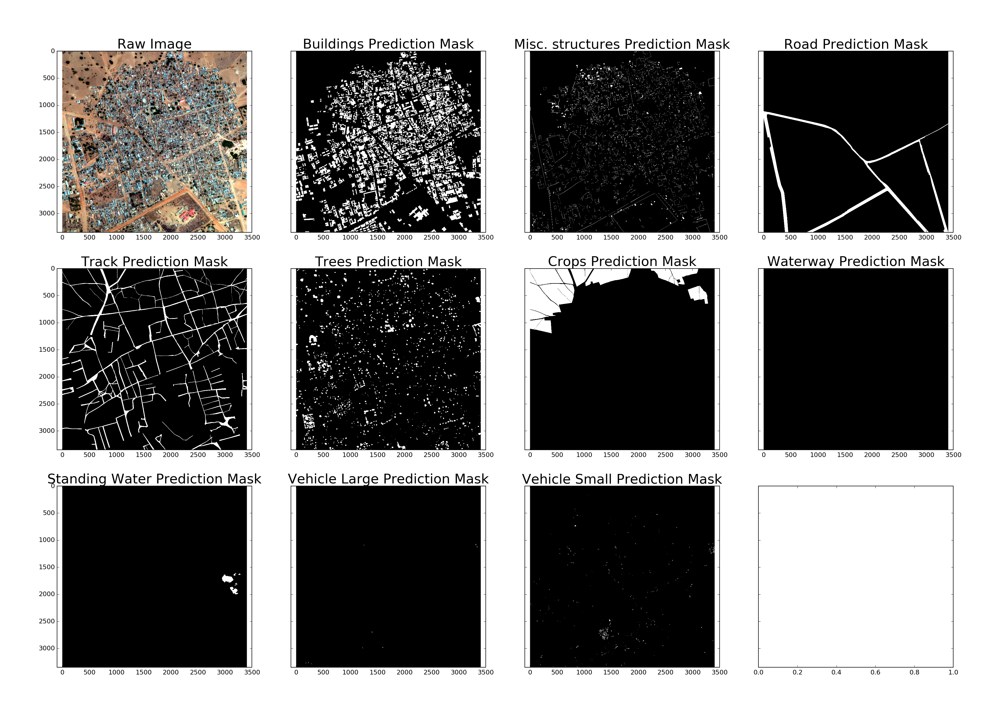

# Dstl-Satellite-Imagery-Feature-Detection-Improved
Work in Progress PyTorch version of the [Dstl feature detection kaggle challenge](https://www.kaggle.com/c/dstl-satellite-imagery-feature-detection) on Kaggle.

The goal was to find ten potentially overlapping features (buildings, other structures, roads, tracks, trees,
crops, rivers, lakes, trucks, cars) in satellite images. This solution uses the [U-Net](https://arxiv.org/abs/1505.04597) neural network
architecture to segment the images for ten binary classes.

## Check out the notebooks

- [Exploration_and_Setup.ipynb](Exploration_and_Setup.ipynb) looks at the images and their labels and shows how cropping and augmentations look like
- [Training.ipynb](Training.ipynb) prepares and trains a U-Net model for one to ten classes in PyTorch
  - While training loss curves and validation mask predictions are exported with visdom. Start the visdom server with 
```python
python -m visdom.server
```
- [Predict.ipynb](Predict.ipynb) predicts test image masks and saves them for later submission
- [Evaluate_and_Submit.ipynb](Evaluate_and_Submit.ipynb) shows our results on the validation images and creates the final submission, which we also check.

## Example input image


## Example output feature detection


#### Thanks to Konstantin Lopuhin from who I used some code from [his repo](https://github.com/lopuhin/kaggle-dstl).
